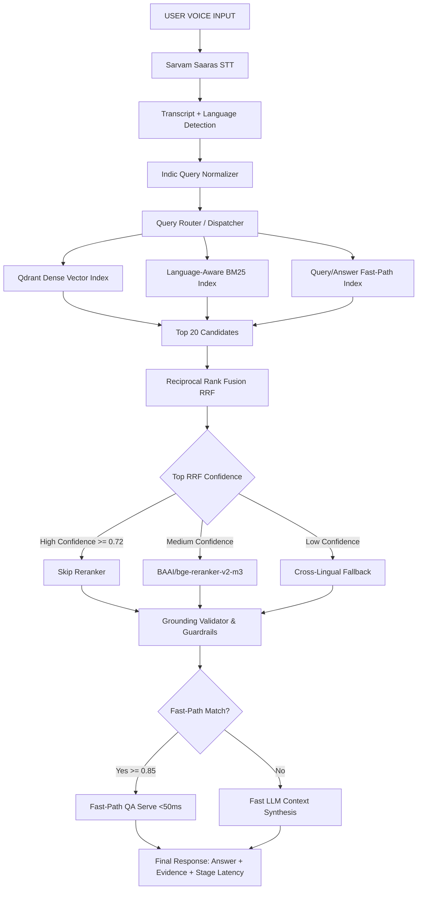

# Architectural Design Document — IndicVoiceRAG

## System Overview
**IndicVoiceRAG** is an adaptive, high-performance voice-enabled Retrieval-Augmented Generation (RAG) model specifically engineered for Indic languages (Hindi, Telugu, Tamil, Kannada, Malayalam, Marathi, Gujarati, Bengali, Odia, Punjabi, Assamese, Nepali, Sanskrit, Urdu) and Code-Mixed queries (e.g., Hinglish, Teluglish).

---

## Architecture Flow Diagram

---

## Component Rationale & Engineering Decisions

### 1. Speech-to-Text (STT) Strategy
- **Sarvam Saaras STT Integration**: Official integration using `POST https://api.sarvam.ai/speech-to-text` with `saaras:v1`.
- **Latency Optimization**: Direct streaming audio handling via Web Audio API and WebSocket endpoint `/ws/transcription`.

### 2. Multi-Resolution Offline Chunking
To solve the trade-off between retrieval specificity and sentence context, we implement 5 logical chunking representations:
- **Level 1 (PassageChunker)**: Full MS MARCO passage context.
- **Level 2 (SentenceChunker)**: Sentence grouping.
- **Level 3 (OverlapChunker)**: Sliding window word/token chunks.
- **Level 4 (SemanticChunker)**: Structural paragraph and topic transition chunks.
- **Level 5 (ParentChildChunker)**: Hierarchical child sentence chunks linking to parent passage IDs.

*Crucial Performance Rule*: All multi-resolution chunking occurs **OFFLINE** during dataset ingestion (`scripts/build_indexes.py`). Zero chunking happens during runtime user requests.

### 3. Hybrid Retrieval & RRF Fusion
Single dense retrieval often misses specific proper nouns or script spelling variations in Indic languages. We deploy a tri-branch hybrid retriever:
1. **Branch 1 — Qdrant Dense Vector Search**: Captures cross-lingual semantic similarity.
2. **Branch 2 — Language-Aware BM25 Search**: Captures exact word, entity, and script matches.
3. **Branch 3 — Searchable Query/Answer (QA) Search**: Matches user question against known dataset QA pairs.

The candidate ranks are merged using **Reciprocal Rank Fusion (RRF)**:
$$RRF\_score(d) = \frac{0.5}{60 + r_{\text{dense}}(d)} + \frac{0.3}{60 + r_{\text{bm25}}(d)} + \frac{0.2}{60 + r_{\text{qa}}(d)}$$

### 4. Adaptive Reranking
Running cross-encoder reranking on every query adds 150-300ms latency. We implement **Adaptive Conditional Reranking**:
- If top candidate RRF score exceeds `HIGH_CONFIDENCE_THRESHOLD` (0.72), the reranker is **bypassed** with zero latency cost.
- Reranking is invoked only when candidate confidence is ambiguous.

### 5. Grounding Verification & Guardrails Engine
The system includes `GuardrailEngine` implementing 7 distinct checks:
1. Empty input check.
2. Off-topic query rejection.
3. Low retrieval confidence threshold.
4. Grounding validation (claim-to-context overlap score).
5. Prompt injection defense (retrieved passages treated strictly as DATA).
6. Unsafe input filter.
7. Answer claim validation.

### 6. Sub-200ms Latency Budget Execution
- **Fast-Path QA Routing**: Direct matches (similarity > 0.85) bypass LLM generation, delivering grounded answers in sub-50ms total time.
- **In-Memory Caching & Connection Pooling**: Reuses embedding models and Qdrant connections across pipeline calls.
